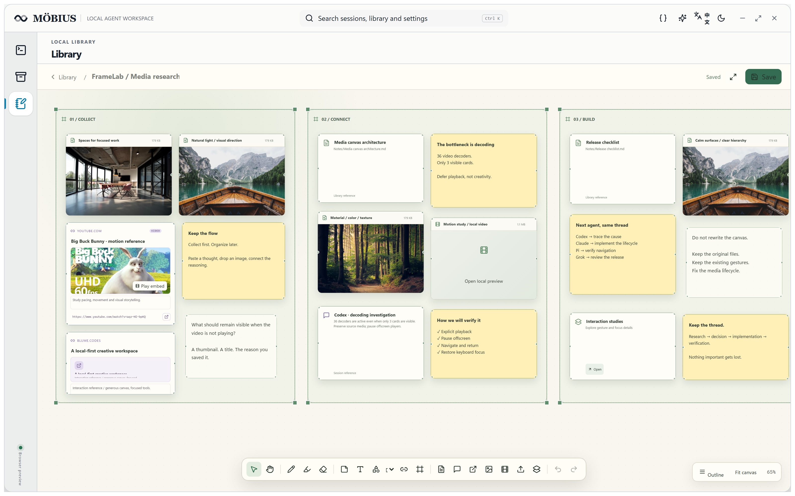

# MÖBIUS

[](http://8.137.87.76/mobius/)

**Switch agents. Keep the work.**

A local-first Windows workspace for people who use Codex, Claude Code, Pi, and Grok across the same projects. Built with a **Rust core, Tauri 2 desktop shell, React/TypeScript UI and SQLite local index**.

[简体中文](README.zh-CN.md) · [Live product site](http://8.137.87.76/mobius/?lang=en) · [Watch the film](http://8.137.87.76/mobius/?lang=en#demo) · [Releases](https://github.com/TardisBooo/Mobius/releases) · [Acceptance evidence](docs/acceptance/real-desktop-20260908.md) · [MIT License](LICENSE)

> Möbius is a development preview. Compatibility is verified per harness and published with evidence. It does not include model accounts, subscriptions, or API credits.

## Four connected workflows

- **Hand off sessions** to another agent, with a reviewable trace.
- **Follow project history** through a persistent handoff graph.
- **Search conversation content** and inspect the exact source message.
- **Write documents and collect multimedia** on a free canvas beside your workbench.

## Why Möbius

Agent CLIs remember their own sessions. They do not give you one project-shaped view of the work that moved between them. Möbius groups sessions by working directory and worktree, opens the original agent in an interactive PowerShell, and creates explicit cross-agent handoffs without rewriting source history.

| Without Möbius | With Möbius |
| --- | --- |
| Remember which terminal owns a discussion | Start from the project and see its sessions |
| Re-explain architecture, failures, and progress | Carry a reviewable trajectory into the next agent |
| Search every harness separately | Search approved local sources from one place |
| Keep notes, canvases, and skills in unrelated tools | Manage supporting material beside the project |

## Product film

[](http://8.137.87.76/mobius/?lang=en#demo)

**[▶ Play the complete 76-second film with sound](http://8.137.87.76/mobius/?lang=en#demo)** · [Direct MP4](http://8.137.87.76/mobius/media/mobius-product-film.mp4)

The preview above is an animated GIF. The full video player opens on the product site; a repository MP4 link is not an inline GitHub player.

A 76-second English motion-led tour. Real light-mode screenshots move from complete context into focused feature close-ups. Projects and conversations use fictional demo data; agent output is scripted. This film is not native-agent acceptance evidence, and no personal sessions are shown. See the [media credits](licenses/MEDIA-CREDITS.md).

## Core workflows

### Feature map

| Capability | What you can do |
| --- | --- |
| **Rust-powered, local-first** | Rust handles indexing, harness adapters, handoff data and local services; Tauri hosts the desktop UI. Your model accounts remain your own. |
| **Multi-agent session library** | Aggregate approved Codex, Claude Code, Pi and Grok transcripts by project directory and worktree. |
| **Precise history lookup** | Find a session by name or native ID, inspect original messages, and copy an exact `@session:provider/id#mN` or `#mN-mM` reference. |
| **Full-text history search** | Search locally indexed content with SQLite FTS/BM25, inspect matching source text, and explicitly recall bounded excerpts through Mome. |
| **Cross-agent handoff** | Review a trajectory and launch a new target-agent session in the project directory, without overwriting the source transcript. |
| **Persistent handoff history** | Follow project-level relay links and source message ranges across repeated handoffs. |
| **Native terminal workbench** | Resume the original harness, create blank PowerShell tabs, split panes, and return to running terminals. |
| **Documents and free canvas** | Edit/preview Markdown and organize text, images, video, links, sections and nested canvases in one library. Mount external folders read-only. |
| **Skills and MCP** | Manage global/project skills with editing and version history; use MCP to search sessions and retrieve explicitly approved source ranges. |

### Precise, full-text and semantic search are different

- **Precise references — available:** use a known session ID and message range to retrieve the exact evidence.
- **Keyword/full-text recall — available:** Mome uses a local SQLite FTS/BM25 chunk index, prioritizes the current project/worktree among indexed sources, and returns at most three citable sessions within a 1,200-token output budget.
- **Semantic/vector or hybrid search — not available in v0.3.10:** no embedding model or vector backend is integrated. This is a future capability, not a hidden setting you can enable today. Mome explicitly reports lexical-only retrieval.

Nothing searches other sessions or injects history by default. Local retrieval itself does not call a model; sending selected excerpts to an agent consumes context tokens.

### 1. Find every session from the project

Möbius detects approved Codex, Claude Code, Pi, and Grok roots, reads transcripts without rewriting them, and groups sessions by project directory and worktree.


- Search messages, architecture decisions, progress, and failed attempts.
- Inspect the exact source session and message before acting.
- Copy a precise `@session:provider/id#mN` reference when you know the source.
- Run Mome local lexical recall only when you explicitly want a broader search.

### 2. Resume in real PowerShell

Resume keeps the original harness and native session ID. Möbius opens an interactive PowerShell in the correct working directory instead of replacing the CLI.


You can also open blank PowerShell tabs, split the workspace, and return to existing terminals without losing their state.

### 3. Hand off the full trajectory

Switching agents creates a new target session. Before launch, review the message range, tool calls, failed attempts, corrections, source IDs, and estimated token payload.


The source stays read-only. Repeated handoffs form a relay graph so a later agent can trace the work back to exact evidence instead of receiving only a summary.


### 4. Keep supporting work local

- **Library:** editable Markdown notes with rendered preview.
- **Infinite canvas:** text, sticky notes, sections, links, images, audio, video, PDFs, session references, and nested canvases.
- **Folder mounts:** recursive read-only views of external directories; every level is collapsible.
- **Skills:** inspect, install, edit, remove, and restore global or project skills with version history.
- **Mome:** explicit local FTS/BM25 recall, project/worktree ranking preference, source citations and a visible context budget; no semantic backend is integrated in this release.



## Privacy and context boundaries

- The index reads only finite, approved harness roots.
- Original session JSON/JSONL files are not rewritten.
- Other sessions are not searched or injected by default.
- Local search does not consume model tokens. Selected text consumes tokens only after you send it to an agent.
- Native resume stays with the original harness. Switching harnesses is an explicit handoff into a new session.

## Install

Download the [v0.3.10 Windows preview](https://github.com/TardisBooo/Mobius/releases/tag/v0.3.10): installer or portable EXE. Check the included SHA-256 sums and known limitations. Development builds may be unsigned and trigger SmartScreen.

### Build from source

Requirements: Rust, Node.js with pnpm, Windows C++ Build Tools, and WebView2.

```powershell
git clone https://github.com/TardisBooo/Mobius.git
cd Mobius
pnpm --dir apps/desktop install --frozen-lockfile
pnpm --dir apps/desktop tauri build
```

Bundles are generated under `target/release/bundle`.

## First run

1. Review locally discovered harness roots.
2. Approve the sources you want indexed, or choose an explicit source folder.
3. Build the read-only index.
4. Add or select a project.
5. Preview a session and resume it, or open a blank PowerShell.
6. Use **Handoff to another agent** only when you want a new target session with selected trajectory context.

The six-step in-app guide explains product value, privacy, indexing, resume, handoffs, the library, and skill scopes. It remains available from Help.

## Architecture

| Path | Purpose |
| --- | --- |
| `apps/desktop` | Tauri 2 + React desktop application |
| `apps/website` | Static bilingual product site |
| `crates/mydesk-core` | Local indexing, adapters, workspaces, notes, canvases, and skills |
| `crates/mydesk-mcp` | Read-only MCP session search and approved text retrieval |
| `crates/mydesk-cli` / `crates/mydesk-daemon` | CLI/TUI and local daemon |

Internal crate names retain `mydesk-*` for data and command compatibility.

## Development

```powershell
cargo test --workspace --all-targets --no-fail-fast
pnpm --dir apps/desktop check
pnpm --dir apps/desktop build
pnpm --dir apps/website build
```

Desktop acceptance uses isolated `E:\Workspaces\Mobius-Verification-*` and `D:\DataVault\Mobius-Verification-*` roots. Tests must not target an existing user project or real session history.

The `isolated_acceptance` integration test is opt-in: it requires a separately provisioned Windows fixture and `MOBIUS_VERIFICATION_ROOT`. It is not included in the default test pass; run it explicitly with `--ignored` only after preparing its isolated inputs.

## Inspiration, attribution, and license

Möbius learned from open-source session viewers, agent workspaces, memory systems, note canvases, and skill managers. Product communication also draws inspiration from Blume and AionUi; the editorial scan-line direction references Kate Loseva's hero animation.

See [THIRD_PARTY_NOTICES.md](THIRD_PARTY_NOTICES.md) for the complete research list and licensing boundaries. Möbius source code is released under the [MIT License](LICENSE). Third-party dependencies and referenced projects retain their own licenses and trademarks.
