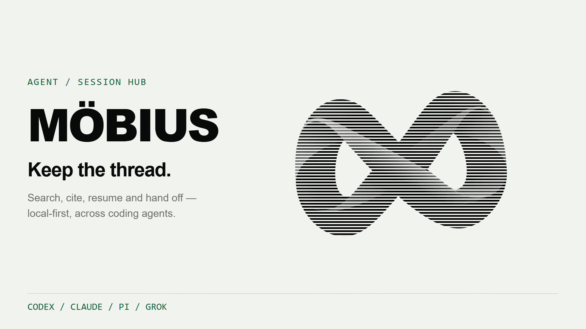
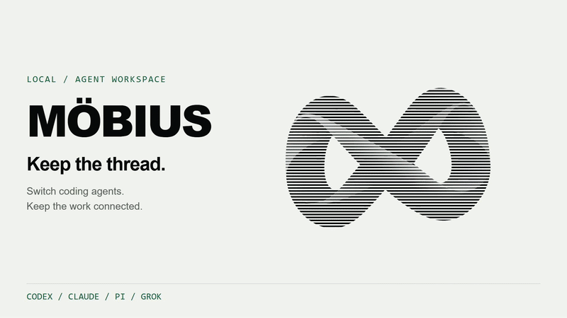
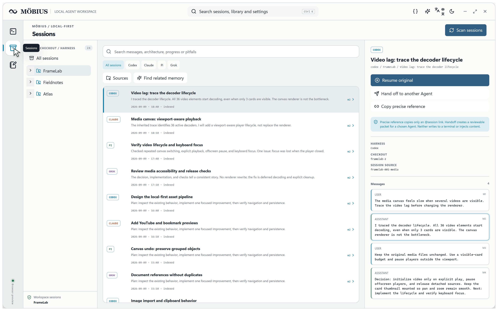
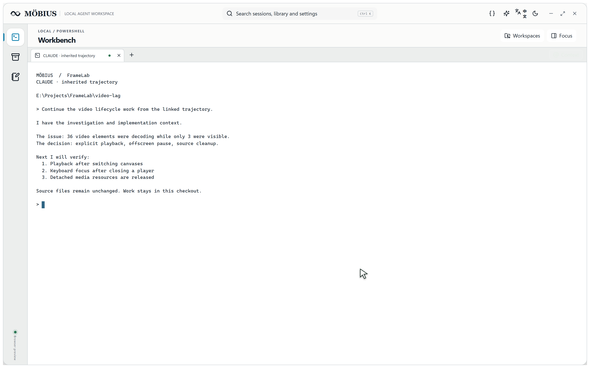
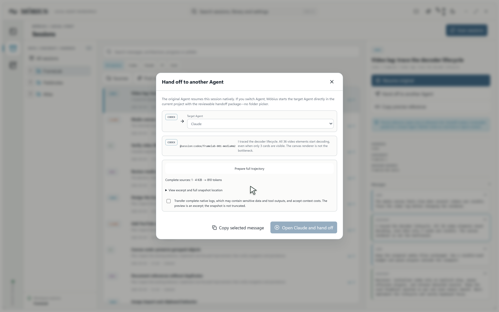
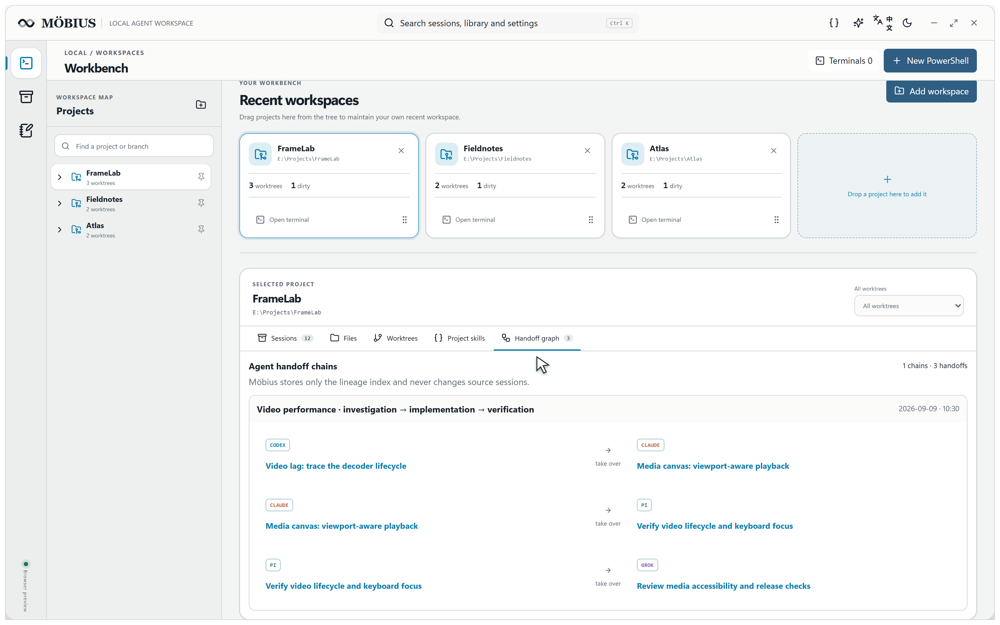

# MÖBIUS · 莫比乌斯

[](http://8.137.87.76/mobius/?lang=zh)

**切换 Agent，工作不断线。**

面向同时在同一项目中使用 Codex、Claude Code、Pi 与 Grok 的 Windows 本地工作台。采用 **Rust 核心、Tauri 2 桌面外壳、React/TypeScript 界面与 SQLite 本地索引**。

[English](README.md) · [在线产品页](http://8.137.87.76/mobius/?lang=zh) · [播放产品视频](http://8.137.87.76/mobius/?lang=zh#demo) · [下载](https://github.com/TardisBooo/Mobius/releases/tag/v0.3.10) · [真实验收记录](docs/acceptance/real-desktop-20260908.md) · [MIT License](LICENSE)

> 当前为开发预览版。兼容性按 Harness 逐项验证并附证据发布。莫比乌斯不提供模型账号、订阅或 API 额度。

## 四项核心能力

- **跨 Agent 交接会话**：审核轨迹后，把上下文带到新会话。
- **追踪项目交接历史**：用持久化关系图看清谁接手了什么。
- **搜索会话内容**：定位决策、尝试与原始消息。
- **记录文档与自由画布**：在工作台旁组织文字、图片、视频和链接。

## 为什么需要莫比乌斯

Agent CLI 各自记得自己的会话，却不会提供一张以项目为中心的工作地图。莫比乌斯按工作目录和 worktree 聚合会话，在真实 PowerShell 中恢复原 Agent，并通过明确审核的跨 Agent 交接传递完整轨迹，而不是覆盖原始会话。

## 产品视频

[](http://8.137.87.76/mobius/?lang=zh#demo)

**[▶ 播放完整 96 秒有声视频](http://8.137.87.76/mobius/?lang=zh#demo)** · [直接打开 MP4](http://8.137.87.76/mobius/media/mobius-product-film.mp4)

上方是 GIF 动态预览，完整播放器在产品页中打开；仓库 MP4 链接不等于 GitHub 内嵌播放器。

96 秒英文日间模式真实界面演示。项目和对话为虚构数据，Agent 输出为脚本演示，不作为真实 Agent 验收证据；不包含个人会话。参见[素材授权说明](licenses/MEDIA-CREDITS.md)。

## 核心功能

### 功能一览

| 能力 | 可以做什么 |
| --- | --- |
| **Rust 实现、本地优先** | Rust 负责索引、Harness 适配、交接数据与本地服务，Tauri 承载桌面界面；模型账号由用户自行配置。 |
| **多 Agent 会话库** | 按项目目录与 worktree 聚合已批准的 Codex、Claude Code、Pi、Grok 会话。 |
| **会话历史精准定位** | 按名称或原生 ID 找会话，查看原始消息，复制精确到 `@session:provider/id#mN` 或 `#mN-mM` 的引用。 |
| **会话内容全文搜索** | 使用 SQLite FTS/BM25 检索本地索引、查看命中原文；通过 Mome 主动提取有预算限制的历史片段。 |
| **跨 Agent 交接** | 审核完整轨迹后，在项目目录启动目标 Agent 的新会话，不覆盖来源记录。 |
| **持久化交接历史** | 在项目交接图中回溯多轮接手关系与来源消息范围。 |
| **原生终端工作台** | 恢复原 Harness、新建空白 PowerShell、分屏并返回运行中的终端。 |
| **文档与自由画布** | Markdown 编辑／预览，统一组织文字、图片、视频、链接、分区及子画布，支持外部目录只读挂载。 |
| **技能与 MCP** | 管理全局／项目技能，编辑并查看历史版本；通过 MCP 搜索会话、读取明确授权的来源范围。 |

### 精准搜索、全文搜索与语义搜索的区别

- **精准引用：已支持。** 已知 session ID 和消息范围时，直接定位对应证据。
- **关键词／全文检索：已支持。** Mome 使用本地 SQLite FTS/BM25 分块索引，在已索引来源中优先排序当前项目／worktree，每次最多返回三个可引用会话，输出预算上限为 1,200 token。
- **语义／向量与混合检索：v0.3.10 尚未提供。** 当前未接入 embedding 模型或向量后端，这是后续能力，不是可在设置中开启的现成功能；Mome 会明确显示当前仅为词法检索。

默认不搜索其他会话，也不自动注入历史。本地检索不调用模型；将选中的片段发给 Agent 后，会占用上下文 token。

### 1. 按项目找到全部会话



- 支持已批准的 Codex、Claude Code、Pi 与 Grok 来源目录。
- 搜索消息、架构决策、进度和失败尝试。
- 找到来源后复制精确的 `@session:provider/id#mN` 引用。
- 只有主动运行 Mome 时，才检索相关历史，并优先排序当前项目／worktree 的结果。

### 2. 在真实 PowerShell 中恢复



恢复操作保留原 Harness 和原生 session ID，并在正确目录打开可交互 PowerShell。也可以随时创建空白终端、分屏工作并返回仍在运行的标签页。

### 3. 交接完整轨迹



切换 Agent 会创建新的目标会话。启动前可以审核消息范围、工具调用、失败尝试、修正过程、来源 ID 和 token 估算。原始记录保持只读；多次交接会形成可以回溯证据的关系图。



### 4. 本地资料与技能管理

- Markdown 笔记编辑和渲染预览。
- 支持文本、随笔、分区、链接、图片、音频、视频、PDF、会话引用和子画布的无限画布。
- 外部目录只读挂载，目录树每一层均可折叠。
- 全局与项目技能的查看、安装、编辑、卸载和历史版本恢复。

## 隐私与上下文边界

- 只读取有限且经批准的 Harness 来源目录。
- 不重写原始 session JSON/JSONL。
- 默认不搜索或注入其他会话。
- 本地检索本身不消耗模型 token；只有发送所选内容时才会产生 token 消耗。
- 原生恢复保持原 Agent；切换 Agent 是明确的新会话交接。

## 安装

从 [GitHub Releases](https://github.com/TardisBooo/Mobius/releases/tag/v0.3.10) 下载 v0.3.10 Windows 预览版安装包或便携 EXE，并核对 SHA-256 和已知限制。构建尚未签名，可能触发 SmartScreen。

### 从源码构建

需要 Rust、Node.js/pnpm、Windows C++ Build Tools 和 WebView2。

```powershell
git clone https://github.com/TardisBooo/Mobius.git
cd Mobius
pnpm --dir apps/desktop install --frozen-lockfile
pnpm --dir apps/desktop tauri build
```

## 首次使用

1. 检查本地发现的 Harness 来源。
2. 批准需要索引的来源，或明确选择来源目录。
3. 建立只读索引。
4. 添加或选择项目。
5. 预览并恢复原会话，或打开空白 PowerShell。
6. 只有需要新建目标 Agent 会话时，才使用“交接给其他 Agent”并选择轨迹范围。

应用内六步引导会详细说明产品价值、隐私边界、索引方式、原生恢复、交接图、资料库和技能范围，并可从帮助入口再次打开。

## 开发与验证

```powershell
cargo test --workspace --all-targets --no-fail-fast
pnpm --dir apps/desktop check
pnpm --dir apps/desktop build
pnpm --dir apps/website build
```

桌面验收只能使用隔离的 `E:\Workspaces\Mobius-Verification-*` 和 `D:\DataVault\Mobius-Verification-*`，不得针对已有用户项目或真实会话。

## 灵感、署名与许可

项目参考了开源会话查看器、Agent 工作台、记忆系统、笔记画布和技能管理器；产品表达参考 Blume 与 AionUi，官网扫描线方向参考 Kate Loseva 的 Hero 动效。

完整研究来源和许可边界见 [THIRD_PARTY_NOTICES.md](THIRD_PARTY_NOTICES.md)。项目代码使用 [MIT License](LICENSE)，第三方依赖、参考项目与商标保留各自许可和权利。
