# Möbius · 莫比乌斯 — 你的 Agent 会话层

开源的跨 Agent **会话层**。在 Claude Code、Codex、OpenCode、Pi、Grok 与 OMP 之间**搜索、引用、恢复、交接**上下文。不改写任何 Harness。交接**传引用，不传摘要**。

**数据在你这台电脑上。** 索引是本地 SQLite FTS/BM25。已批准的会话仍在各 Harness 目录里，莫比乌斯只读。OpenCode 来自只读 `opencode.db`。模型账号、订阅和 API 额度仍由你已安装的 CLI 管理。莫比乌斯本身没有付费档，也不会主动上报。

[English](README.md) · [产品页](http://8.137.87.76/mobius/?lang=zh) · [CLI / MCP](https://github.com/TardisBooo/mobius-connect) · [下载](https://github.com/TardisBooo/Mobius/releases/tag/v0.3.19) · [MIT License](LICENSE)

> Windows 开发预览 v0.3.19。兼容性按 Harness 逐项验证并附证据。这不是 Microsoft Mobius、ControlTheory Möbius 或 Circular Labs Mobius。OpenClaw（`~/.openclaw`）在路线图上，本预览没有该适配器。

## 哲学

**Session** 是工作的持久单位：Harness + 原生 id + 原始 transcript。Git 记录最终进树的内容。Session 记录它为什么进树——失败尝试、工具轨迹、最后那次修正。磁带才是资产。摘要是对磁带的主张，主张会过期。

Agent 已经把这些 transcript 写在磁盘上，却埋在 `~/.codex`、`~/.claude/projects`、OpenCode 的 `opencode.db` 里。两周后你找不到改写鉴权中间件的那次 Claude 对话。把一份简报贴进 Codex，下一个 Agent 会编一份源会话从未同意的待办。同一 checkout 上的 Harness 越多，粘贴税越重。

莫比乌斯放在这些 CLI 之间，不替换它们。

- 原生 resume 仍走原 Harness。切换 Agent 一定打开**新**会话。
- 信封是已确认 Session 身份和祖先边组成的图，不是生成的 handover.md。
- 完整轨迹（消息、工具、失败、修正）用引用保存，比压缩更便宜。1.2 GB 的 JSONL 也能交接，因为信封里没有正文。
- 交接图谱让多 Agent 项目可审计。Codex → Claude → Pi 是接力链，是 DAG。「回去」是第三个会话，不是环。沿链回到精确证据。

需要简报就写成笔记。会话层负责留住磁带。

## 能做什么

| 能力 | 你得到什么 |
| --- | --- |
| 按项目聚合会话 | Codex、Claude Code、OpenCode、Pi、Grok、OMP，按目录和 worktree |
| 搜索与引用 | 本地 SQLite FTS/BM25；复制 `@session:provider/id#mN-mM` |
| 本地记忆（Mome） | 显式召回，最多 3 个会话 / 约 1200 token；默认不注入 |
| 原生恢复 | 协议已验证时，在 PowerShell 里走原 CLI + 原生 id |
| 只传引用的交接 | 新建目标会话；审核范围、工具、token；来源只读 |
| 交接图谱 | 接力 DAG；跨 Agent 回溯 |
| CLI + MCP | [mobius-connect](https://github.com/TardisBooo/mobius-connect)；MCP 不能签发审批 |
| 笔记、画布、技能 | Markdown、无限画布、目录挂载、技能版本 |

发布用的 CLI 与 MCP 是 [mobius-connect](https://github.com/TardisBooo/mobius-connect)。

## 产品视频

[](http://8.137.87.76/mobius/?lang=zh#demo)

**[▶ 播放 109 秒演示](http://8.137.87.76/mobius/?lang=zh#demo)** · [直接打开 MP4](http://8.137.87.76/mobius/media/mobius-product-film.mp4) · [60 秒 GIF](apps/website/public/product/session-hub-60s.gif)

真实界面录制与截图，虚构演示数据，Agent 输出为脚本演示，不作为真实 Agent 验收证据；不含个人会话。[素材授权](licenses/MEDIA-CREDITS.md)。影片源工程归档在仓库外。

## 功能切片（与成片一一对应）

每段 GIF 对应产品视频的一章。产品本身索引 OpenCode；成片画面使用 Codex、Claude、Pi、Grok。

### 01 工作区 — 多个 Agent，同一个项目

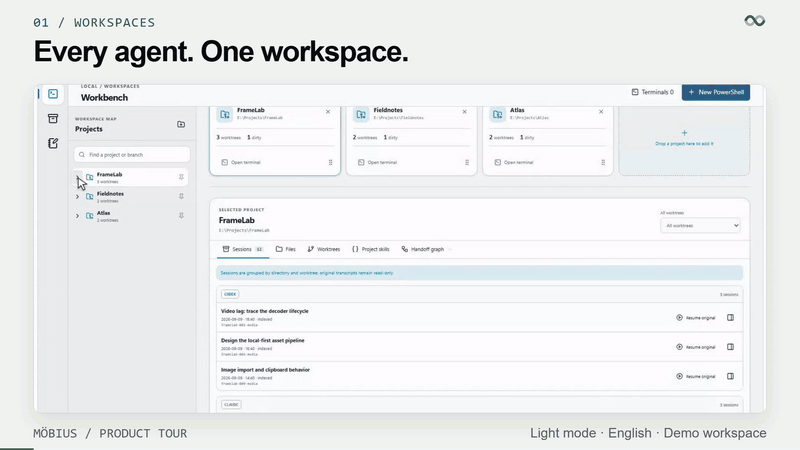

按项目目录与 worktree 聚合已批准的 Codex、Claude Code、OpenCode、Pi、Grok 与 OMP 会话。OpenCode 来自只读 `opencode.db`，定位符形如 `{db}#opencode:{id}`。

### 02 会话搜索 — 找到那条决策

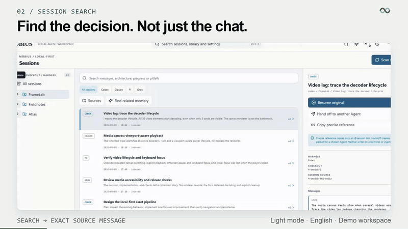

从一个入口搜索已批准的本地来源。查看命中的原始消息，再复制 `@session:provider/id#mN` 或 `#mN-mM`。

### 03 本地记忆 — 只有你开口才检索

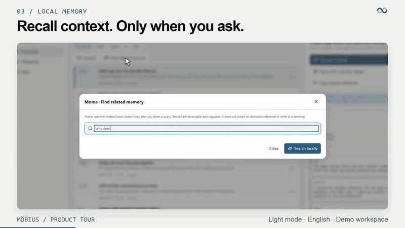

Mome 用本地 SQLite FTS/BM25，优先当前项目／worktree，每次最多三个可引用会话，输出约 1,200 token。默认不搜索其他会话，也不自动注入历史。

混合排序需显式开启。`mobius mome semantic enable` 或 `mobius-connect semantic enable` 会把已索引分块送到本机 Ollama。向量是可再生派生物。Ollama 不在时仍走词法，并报告该状态。本地词法检索不消耗模型 token。

### 04 引用交接 — 传引用，不传摘要

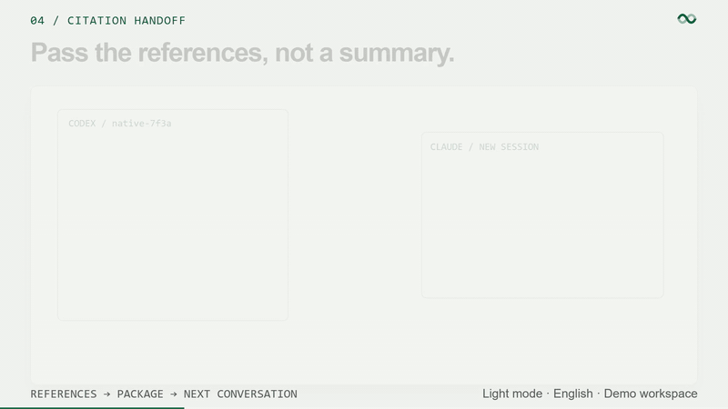

复制精确消息范围，封成 `references_only` 包，送进下一场对话。下一个 Agent 读的是已确认祖先，不是生成的简报。

### 05 Agent 交接 — 新会话，同一项目

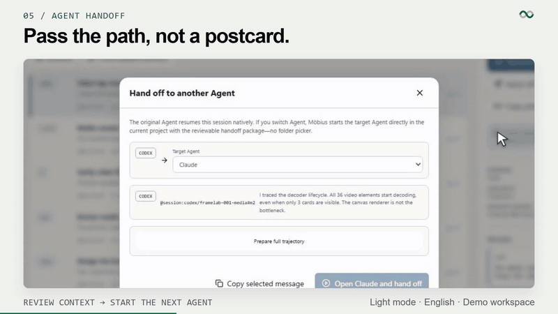

切换 Agent 会创建新的目标会话。启动前可以审核消息范围、工具调用、失败尝试、修正过程、来源 ID 和 token 估算。原始记录保持只读。多次交接形成接力 DAG：A→B 再「回去」是 A→B→C，不是环。

### 06 继续工作 — 原生恢复仍走原 Harness

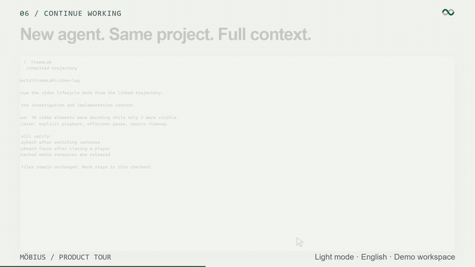

恢复保留原 CLI 和原生 session ID，并在正确目录打开可交互 PowerShell。仅当已安装 Harness 有经过验证的恢复协议时显示原生恢复。OMP 使用其公开的 `--cwd … --resume …` 流程；当前 Grok 与 OpenCode 历史仅支持查看、搜索与交接。

### 07 交接图谱 — 沿链回溯

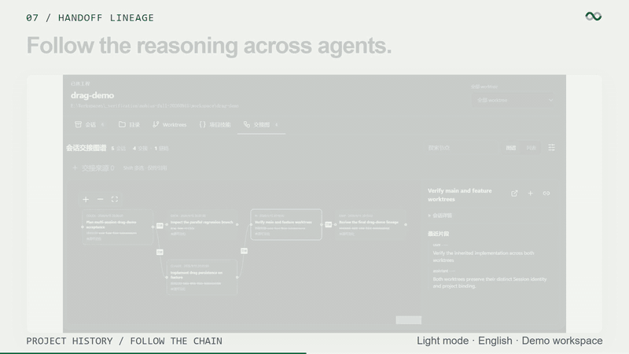

每次交接都会成为原始来源会话与新目标会话之间的一条边。沿图回溯到精确证据。

### 08 无限画布

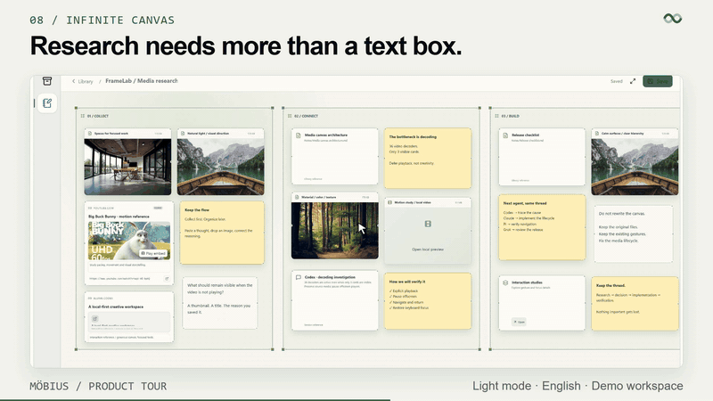

在工作台旁组织文本、便签、分区、链接、图片、音视频、PDF、会话引用和嵌套画布。

### 09 多媒体笔记

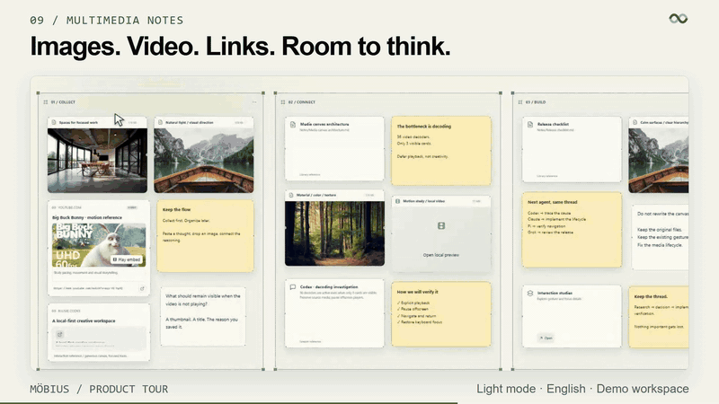

图片、视频和链接与产生它们的会话放在同一研究空间。

### 10 文档与目录

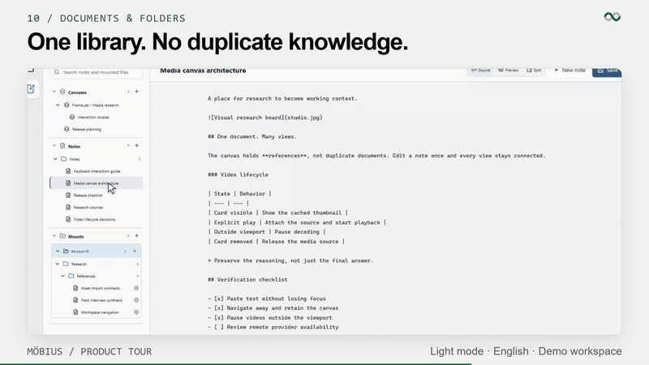

可编辑 Markdown 与渲染预览。外部目录以递归只读方式挂载。

### 11 技能管理

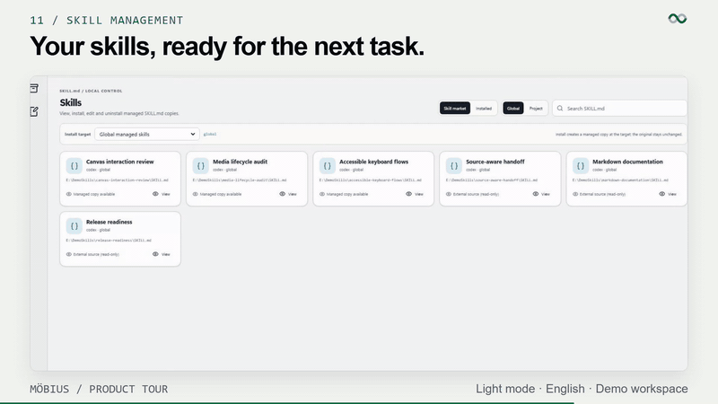

按全局或项目范围检查、安装、编辑、删除并按版本恢复技能。

### 12 CLI + MCP — 同一套会话层，在终端里

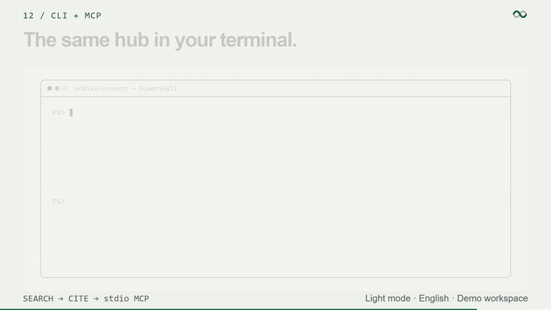

发布用的会话层二进制是 [mobius-connect](https://github.com/TardisBooo/mobius-connect)。**MCP 不能签发审批令牌。**

```powershell
mobius-connect init
mobius-connect sources add opencode $env:USERPROFILE\.local\share\opencode
mobius-connect sources refresh
mobius-connect sessions search "flaky tests"
mobius-connect mcp serve
```

MCP 不能签发审批令牌、不能添加来源、不能接管 PTY。每条命令的 GIF 在 [mobius-connect README](https://github.com/TardisBooo/mobius-connect)。工具表见 [MCP.md](https://github.com/TardisBooo/mobius-connect/blob/main/docs/MCP.md)。

## 安装

从 [v0.3.19 Releases](https://github.com/TardisBooo/Mobius/releases/tag/v0.3.19) 下载 Windows 安装包或便携 EXE，并核对 SHA-256 和已知限制。开发构建可能未签名，会触发 SmartScreen。

```powershell
git clone https://github.com/TardisBooo/Mobius.git
cd Mobius
pnpm --dir apps/desktop install --frozen-lockfile
pnpm --dir apps/desktop tauri build
```

需要 Rust、Node.js/pnpm、Windows C++ Build Tools 和 WebView2。莫比乌斯只通过各 Harness 公开的命令行接口调用已安装程序。

## 快速开始

1. 检查本地发现的 Harness 来源。
2. 批准需要索引的来源，或明确选择目录。
3. 建立只读索引。
4. 添加或选择项目。
5. 预览并恢复原会话，或打开空白 PowerShell。
6. 只有需要新建目标 Agent 会话时，才使用「交接给其他 Agent」。

## 安全边界

- 只读取有限且经批准的来源目录。
- 不重写原始 session JSON/JSONL 与 OpenCode SQLite。
- 默认不搜索或注入其他会话。
- 原生恢复保持原 Agent；切换 Agent 是明确的新会话交接。
- 审批令牌短时、一次性、限定范围。由桌面或 `mobius-connect approvals` 在真人输入 `APPROVE` 后签发。MCP 不能自己签发。

## 支持的 Harness

Codex、Claude Code、OpenCode、Pi、Grok、OMP。OpenClaw 尚未适配。原生恢复仅在协议已验证时启用。当前 Grok 与 OpenCode 历史仅支持查看、搜索与交接。

## 文档

| 目的 | 入口 |
| --- | --- |
| 产品页 / FAQ | http://8.137.87.76/mobius/?lang=zh |
| CLI 与 MCP | https://github.com/TardisBooo/mobius-connect |
| 跨 Agent 交接 | [docs/blog/01-cross-agent-handoff.md](docs/blog/01-cross-agent-handoff.md) |
| 精确引用 vs 摘要 | [docs/blog/02-citation-not-summary.md](docs/blog/02-citation-not-summary.md) |
| 审批令牌 | [docs/blog/03-approval-tokens.md](docs/blog/03-approval-tokens.md) |
| 发布稿 | [docs/gtm/launch.md](docs/gtm/launch.md) |

## 开发

```powershell
cargo test --workspace --all-targets --no-fail-fast
pnpm --dir apps/desktop check
pnpm --dir apps/desktop build
pnpm --dir apps/website build
```

桌面验收只能使用隔离的验证根目录，不得针对已有用户项目或真实会话。数据默认写在本机应用数据目录（Windows 为 `%LOCALAPPDATA%\Mobius`，其他平台为 `~/.local/share/mobius`）。发布版可在「设置」里改数据目录，保存在 `%APPDATA%\Mobius\settings.json`（或其他平台的 `~/.config/mobius/settings.json`）。`MOBIUS_DATA_ROOT` / `--data-root` 仍可覆盖单次启动。二进制不写死盘符。

完整研究来源见 [THIRD_PARTY_NOTICES.md](THIRD_PARTY_NOTICES.md)。代码使用 [MIT License](LICENSE)。
